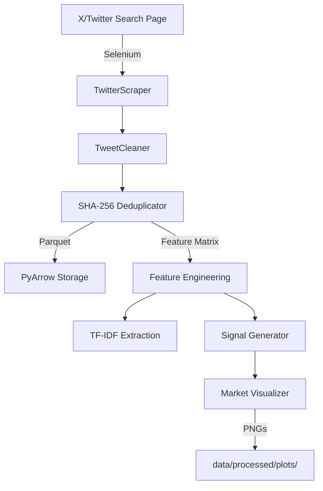
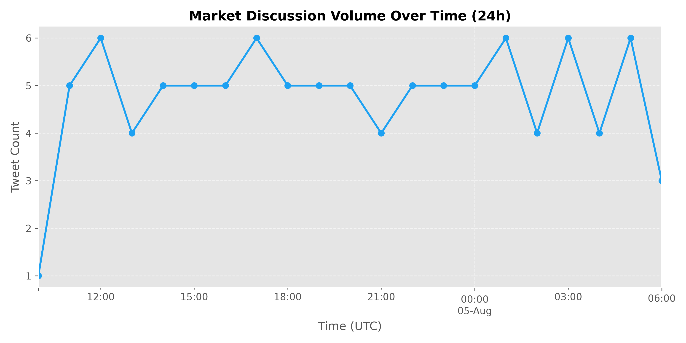
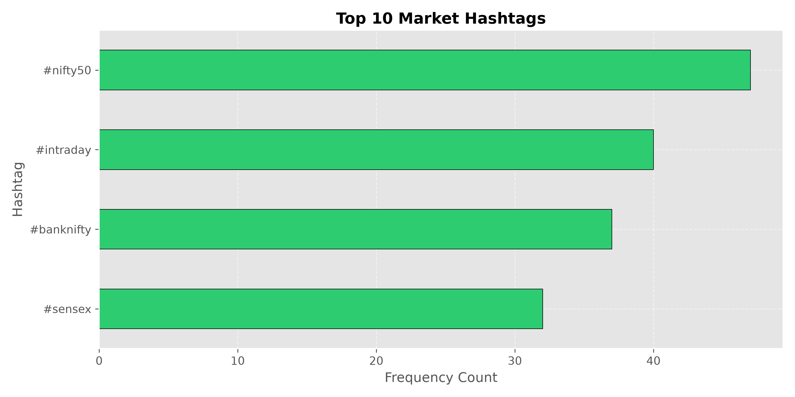
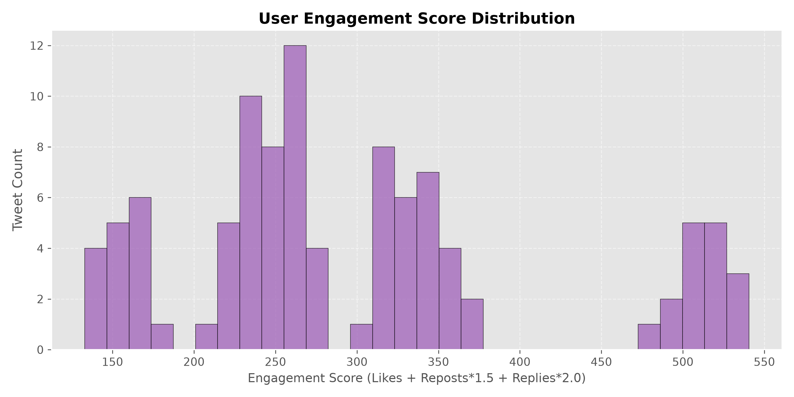
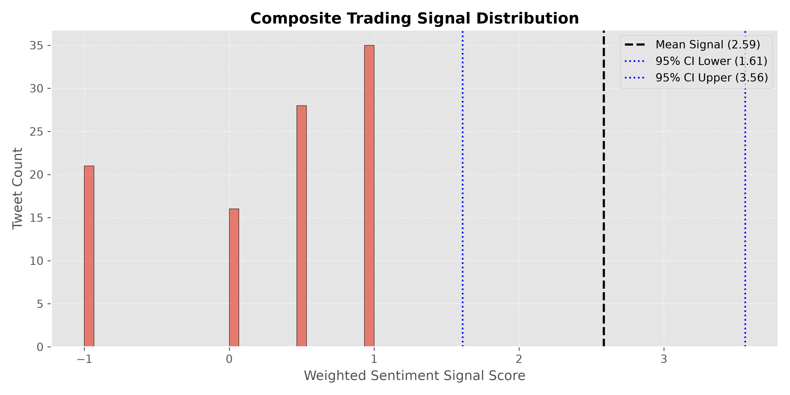

# MarketIQ: Market Intelligence Data Pipeline

MarketIQ is a Python-based data pipeline for collecting, processing, and analyzing Indian stock market discussions (`#nifty50`, `#sensex`, `#banknifty`, `#intraday`) from X/Twitter. The pipeline ingests raw data via Selenium, deduplicates tweets using SHA-256, stores structured data in Parquet format, extracts TF-IDF terms, and calculates sentiment signals with 95% confidence intervals.

---

## Features

- **Ingestion & Cleaning**: Selenium scraper with SHA-256 tweet deduplication and NFKC text normalization.
- **Storage Engine**: Compressed Parquet format written via PyArrow.
- **Feature Engineering**: Financial sentiment scoring and engagement metrics calculation.
- **Signal Generation**: Trading signal with mean, standard deviation, and 95% confidence intervals.
- **Analytics & Visualization**: Top TF-IDF keyword extraction and Matplotlib chart dashboard generation.

---

## Architecture



---

## Tech Stack

- **Language**: Python 3.12
- **Scraping**: `selenium`, `webdriver-manager`
- **Data & Storage**: PyArrow, Pandas, NumPy
- **NLP / ML**: Scikit-Learn (TF-IDF Vectorization)
- **Visualization**: Matplotlib
- **Config**: Python-Dotenv, Logging

---

## Quickstart

### 1. Installation

```bash
python -m venv .venv

# Windows
.venv\Scripts\activate

# Linux/macOS
source .venv/bin/activate

pip install -r requirements.txt
```

### 2. Environment Configuration

Copy `.env.example` to `.env`:

**Windows (PowerShell)**
```powershell
copy .env.example .env
```

**Linux / macOS**
```bash
cp .env.example .env
```

### 3. Execution

- **Live Ingestion**:
  ```bash
  python main.py
  ```
- **Offline Sample Mode** (Dry Run / Verification):
  ```bash
  python main.py --sample
  ```

---

## Notes & Fallback Behavior

- MarketIQ attempts to collect live market tweets from X/Twitter using Selenium.
- Due to X anti-bot protections and login wall restrictions, live scraping may be restricted.
- If live scraping fails or returns no data, the pipeline automatically falls back to a synthetic dataset so the complete processing, storage, signal generation, and visualization pipeline can be verified end-to-end.

---

## Sample Outputs

### Generated Visualizations

| Tweets Over Time | Top Hashtags |
|:---:|:---:|
|  |  |

| Engagement Distribution | Signal Distribution |
|:---:|:---:|
|  |  |

---

## Project Structure

```
MarketIQ/
├── marketiq/
│   ├── models/         # Tweet domain dataclass
│   ├── scraper/        # Browser manager & X scraper
│   ├── processing/     # Cleaner & SHA-256 deduplicator
│   ├── storage/        # PyArrow Parquet writer
│   ├── analysis/       # Feature engineering, TF-IDF, signals, & plots
│   └── utils/          # Logger & configuration
├── data/
│   ├── raw/            # Raw scraped data
│   └── processed/      # Parquet files & generated plots
├── main.py             # Pipeline entrypoint
├── Dockerfile
├── requirements.txt
└── README.md
```

---

## Scalability (10x Volume)

1. **Distributed Scraping**: Deploy Celery + Redis task queues with a containerized headless browser pool and rotating proxies.
2. **Partitioned Data Lake**: Organize Parquet files into Hive partitions by date and hashtag (`data/processed/date=YYYY-MM-DD/hashtag=X/`).
3. **Stream Processing**: Integrate Kafka and Flink/Spark Streaming for rolling window sentiment signal generation.

---

## License

MIT License. Developed as part of a technical assessment.
